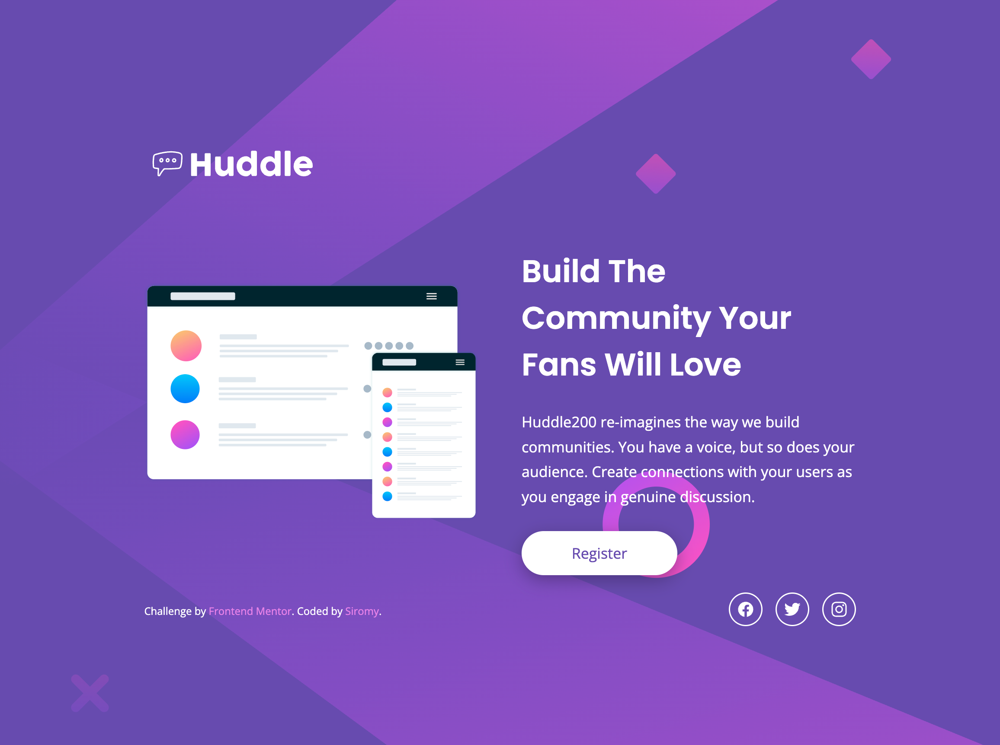

Frontend Mentor - Huddle Landing Page with Single Introductory Section

This is a solution to the [Huddle landing page with single introductory section challenge on Frontend Mentor](https://www.frontendmentor.io/challenges/huddle-landing-page-with-a-single-introductory-section-B_2Wvxgi0).

## Table of contents

- [Overview](#overview)
  - [Screenshot](#screenshot)
  - [Links](#links)
- [My process](#my-process)
  - [Built with](#built-with)
  - [What I learned](#what-i-learned)
  - [Continued development](#continued-development)
- [Author](#author)

## Overview

### Screenshot

**Desktop**


**Mobile**


### Links

- Solution URL: [Frontend Mentor](https://addlinkhere.com)
- Live Site URL: [GitHub Pages](https://addlinkhere.com)

## My process

### Built with

- Flexbox
- CSS Custom Properties
- Desktop-first
- Google Fonts

### What I learned

This project helped me get more comfortable with desktop-first responsive design. The key takeaway was that `max-width` breakpoints need to be wide enough to cover the full range of mobile devices — using `max-width: 375px` only targets a very narrow slice, while `max-width: 768px` properly covers most phones and tablets.

I also learned how to write more flexible widths using `clamp()` instead of fixed values, which prevents layout breakage across different screen sizes.

```css
/* Instead of a rigid fixed width */
min-width: 800px;

/* clamp() adapts fluidly between a min and max */
width: clamp(600px, 85vw, 1300px);
```

And when it comes to `box-shadow`, matching the shadow color to the design's color palette makes a big difference — a hard black shadow feels out of place against a colored background.

```css
/* Too harsh */
box-shadow: 5px 5px 15px black;

/* Softer, on-brand */
box-shadow: 0 6px 20px hsla(257, 40%, 20%, 0.45);
```

### Continued development

Going forward, I want to practice mobile-first workflow from the start, and get more comfortable with clamp() and other fluid sizing techniques for building layouts that feel natural across all screen sizes.

## Author

- Frontend Mentor - [@yourusername](https://www.frontendmentor.io/profile/s1romy)
- GitHub - [@yourusername](https://github.com/s1romy)
